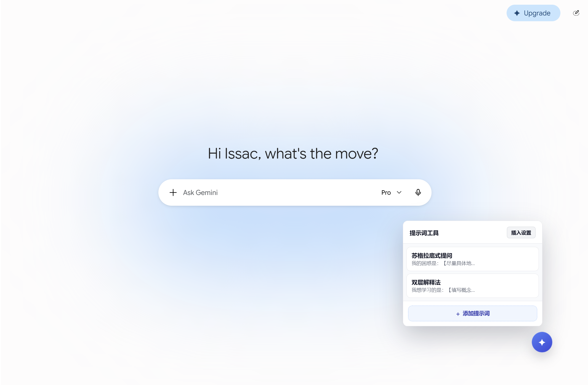
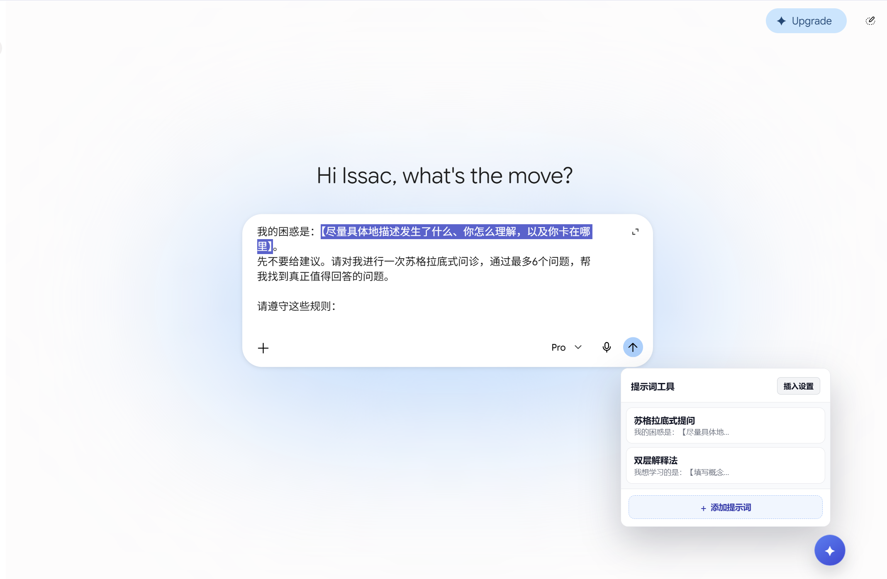

<div align="center">
  
  <h1>提示词工具 (Prompt Helper)</h1>
  <p>在 Gemini 网页版快速插入预设提示词，并把光标或选区放到需要填写的位置。</p>
  <p><strong>本地存储 · 零运行依赖 · 平时不联网 · 不自动发送</strong></p>
</div>



<p align="center"><sub>浮动按钮、提示词面板与插入设置。</sub></p>

## 特性

- 浮动按钮一键唤出提示词面板
- 在当前光标位置插入，不覆盖已有内容，也不会自动发送
- 支持占位符自动定位光标（默认 `【光标】`，可自定义）
- 默认自动选中正文中第一处 `【任意内容】`，可在面板 **插入设置** 中关闭
- 提示词支持新增、编辑、删除、拖动排序和本地持久化
  - 按住词条左侧六点手柄拖动调整顺序；细指针设备也可按住词条正文拖动，松开后不会误插入；触屏请使用左侧手柄
  - 焦点在手柄上时，可用 ↑ / ↓ 方向键移动顺序
  - 顺序写入失败会自动回滚并提示
- 找不到输入框或保存失败时，在浮动按钮旁显示状态提示
- 提示词列表、占位符历史和插入设置可在多个 Gemini 标签页间同步
- Gemini 页面导航或重建 DOM 后，浮动按钮与面板会自动恢复挂载（SPA 单例保护）
- 浮动按钮支持拖拽，位置自动持久化；窗口缩放后位置会夹取回可视范围
- 插入设置中可「检查更新」：仅在点击时查询 GitHub 公开版本号，平时不联网
- 触屏 / 粗指针下，卡片的编辑和删除始终可见，点击不会误插入
- 提示词的增删改查，数据本地存储
- 浅色 / 深色模式自适应，并兼容宿主在 `<html>` 上显式声明的 `.dark` / `[data-theme]` 主题
- 支持 `prefers-reduced-motion`，键盘可访问（Esc 关闭、Tab 焦点循环）

## 安装

本扩展暂未上架 Chrome Web Store，需要手动加载：

1. 克隆或下载本仓库
2. 打开 Chrome，访问 `chrome://extensions`
3. 开启右上角的 **开发者模式**
4. 点击 **加载已解压的扩展程序**
5. 选择本仓库中的 `prompt-helper/` 目录
6. 打开 [Gemini](https://gemini.google.com/)，右下角应出现 ✦ 浮动按钮

## 快速体验

保存下面这条提示词：

```text
我的困惑是：【尽量具体地描述发生了什么、你怎么理解，以及你卡在哪里】。
先不要给建议。请对我进行一次苏格拉底式问诊，通过最多6个问题，帮我找到真正值得回答的问题。
```

点击提示词卡片后，正文会插入 Gemini 输入框，并自动选中第一处 `【…】`。此时直接输入即可整体替换这段文字。



## 使用

1. 在 Gemini 页面点击右下角 ✦ 按钮，打开提示词面板
2. 点击 `+` 添加提示词，填写名称和内容
3. 内容中可使用 `【光标】` 标记希望插入后光标停留的位置
4. 在面板中点击某条提示词，会插入到 Gemini 输入框的当前光标位置；光标占位符会被移除并把光标定位到该位置
5. 按住词条左侧六点手柄拖动可调整顺序，刷新后保持；焦点在手柄上时也可用方向键上下移动
6. 需要关闭 `【…】` 自动选中、或检查更新时，打开面板标题栏的 **插入设置**

### 占位符

优先级：当前自定义光标 → `【光标】` / `[光标]` → 第一处 `【…】`（可关） → 历史兼容占位符。只有实际出现在正文里的规则才会生效。

- 默认占位符：`【光标】`（移除后光标折叠在该处，只处理第一处）
- 兼容旧占位符：`[光标]`
- 通用 `【主题】` 这类标记会留在正文中并被选中，方便直接输入替换；同一条里后面的 `【风格】` 保持原样
- 可自定义任意字符串作为光标占位符，会自动加入历史
- 历史项右键可删除
- **插入设置** 只控制通用 `【…】` 自动选中，不影响光标占位符

## 技术栈

- Chrome Extension Manifest V3
- 原生 JavaScript（content script，无构建步骤）
- 原生 CSS3（无框架）

## 目录结构

```text
docs/images/             # README 截图
prompt-helper/
├── manifest.json        # 扩展清单
├── constants.js         # 占位符与存储键
├── prompt-engine.js     # 占位符匹配 / 历史（可被 Node 测试直接 require）
├── storage.js           # chrome.storage.local 读写与跨标签订阅
├── gemini-editor.js     # Gemini 输入框重建、选区、input/keyup
├── update-check.js      # 手动检查 GitHub Release（仅在点击时联网）
├── content.js           # 面板 / 弹窗 / 插入设置 / 拖动排序 / 状态提示
├── content.css          # 视觉系统与组件样式
├── tests/               # node:test 自动化（驱动 shipped 函数）
├── icons/               # 扩展图标（16 / 48 / 128）
└── TEST_CHECKLIST.md    # 回归测试清单
```

## 数据结构

数据存储于 `chrome.storage.local`：

| Key | 说明 |
|---|---|
| `ph_prompts` | 提示词列表 |
| `ph_placeholder_history` | 占位符历史 |
| `ph_button_pos` | 浮动按钮位置 |
| `ph_auto_select_bracket_placeholder` | 是否自动选中第一处 `【…】`；缺省为开启 |

单条提示词：
```json
{
  "id": "timestamp+random",
  "name": "用户自定义名称",
  "prompt": "提示词内容，可含占位符",
  "placeholder": "【光标】"
}
```

## 开发

无构建步骤，本地修改 → 重载即可：
1. 修改 `prompt-helper/` 下的脚本或 `content.css`
2. 在 `chrome://extensions` 中点击本扩展的"重新加载"
3. **刷新 Gemini 页面**（必须，否则页面内仍在运行旧 content script）
4. 自动化：在 `prompt-helper/` 目录执行 `node --test`
5. 人工回归验证可参考 `prompt-helper/TEST_CHECKLIST.md`

## 隐私与权限

- 扩展声明 `storage`、`activeTab` 权限；仅在 gemini.google.com 页面运行
- 平时不联网。只有你在 **插入设置** 中点击「检查更新」时，才会访问 GitHub 的公开 Release 接口（`https://api.github.com/*`）；不调用模型服务，也不读取或保存 API Key
- 提示词、占位符历史和浮动按钮位置只保存在 Chrome 本地扩展存储中
- 扩展不会上传提示词或聊天内容；插入后是否发送始终由用户决定

## License

[MIT](LICENSE)
